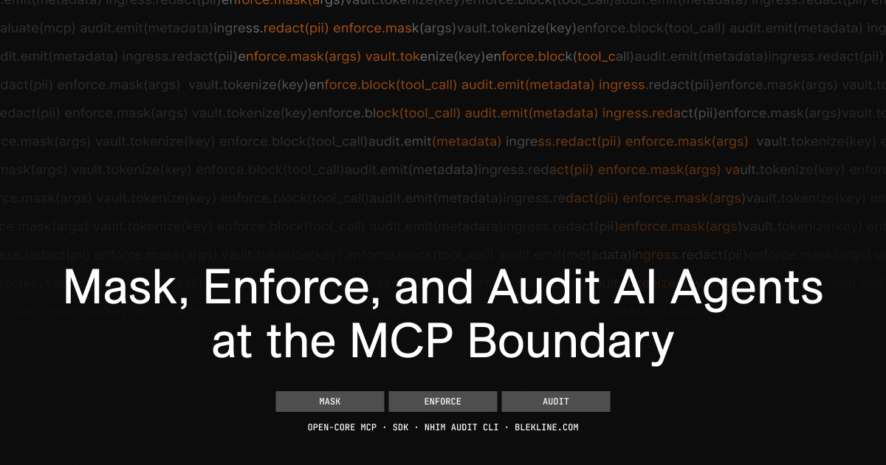
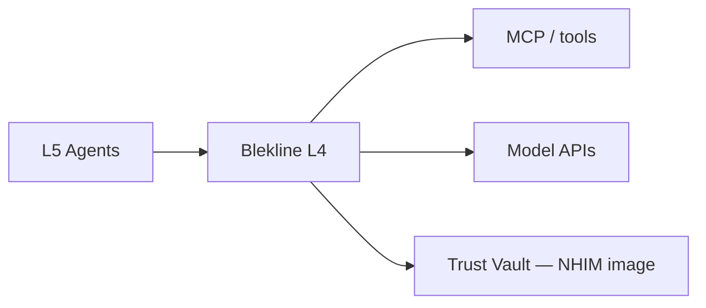

<!-- GitHub repo About field: Non-Human Identity & Runtime Enforcement for AI agents — open-core MCP/SDK to mask, enforce, and audit agent calls. -->
<!-- Social preview / Open Graph: assets/images/blekline-oss-og.png — also upload in GitHub Settings → General → Social preview -->
<div align="center">
<a href="https://app.blekline.com"></a>
<picture>
<source media="(prefers-color-scheme: light)" srcset="assets/images/blekline-logo-light.svg"/>

</picture>
</div>
<p align="center">
  <a href="https://app.blekline.com/docs/get-started/paths">Choose your path</a> ·
  <a href="https://app.blekline.com/docs">Quick start</a> ·
  <a href="https://app.blekline.com/docs">Docs</a> ·
  <a href="https://app.blekline.com">Cloud</a>
</p>

<p align="center">
  <a href="https://github.com/Blekline/blekline-oss/actions/workflows/oss-ci.yml"></a>
  <a href="LICENSE"></a>
  <a href="LICENSE-APACHE"></a>
  <a href="https://www.npmjs.com/package/@blekline/mcp-server"></a>
  <a href="https://www.npmjs.com/package/@blekline/mcp-proxy"></a>
  <a href="https://www.npmjs.com/package/@blekline/nhim-audit"></a>
</p>

---

**Blekline** governs agent traffic — MCP tool calls, prompt ingress, and sidecar hops — before models or sandboxes act.

This is Blekline’s **open-core repository**: npm packages, client integrations, and the NHIM audit CLI. Hosted docs and the control plane live on **[app.blekline.com](https://app.blekline.com)**. Start on **Free** — [choose your path](https://app.blekline.com/docs/get-started/paths) (Individual / Team / Enterprise / API), then Claude Code, Desktop, or Cursor. You do not need to clone this repo first.

## Quick start (60 seconds)

No clone. Create a [Free workspace](https://app.blekline.com/auth/signup), copy a token from **Admin → API keys**, then:

```bash
npx -y @blekline/init
export BLEKLINE_WORKSPACE_TOKEN="blw_..."
export BLEKLINE_API_URL="https://app.blekline.com"
export BLEKLINE_CLIENT_SURFACE="sdk"
npx -y @blekline/mcp-server
```

Connect a client: [Claude Code](https://app.blekline.com/docs/mcp/claude-code) · [Claude connector (OAuth)](https://app.blekline.com/docs/mcp/claude-connector) · [Cursor](https://app.blekline.com/docs/mcp/cursor) · [Codex](https://app.blekline.com/docs/mcp/codex)

CLI: [cli/README.md](cli/README.md) · CI: [ci/](ci/) · 3-minute product path: [Quick Start](https://app.blekline.com/docs)

## Packages

| Package | Install | License |
| ------- | ------- | ------- |
| `@blekline/mcp-server` | `npx -y @blekline/mcp-server` | AGPL-3.0 |
| `@blekline/mcp-proxy` | `npm i @blekline/mcp-proxy` | AGPL-3.0 |
| `@blekline/client` | `npm i @blekline/client` | Apache-2.0 |
| `@blekline/contracts` | workspace / embed | Apache-2.0 |
| `@blekline/init` | `npx @blekline/init` | Apache-2.0 |
| `@blekline/claude-sdk` | `npm i @blekline/claude-sdk` | Apache-2.0 |
| `@blekline/cursor-hooks` | `npm i @blekline/cursor-hooks` | Apache-2.0 |
| `@blekline/codex-hooks` | `npm i @blekline/codex-hooks` | Apache-2.0 |
| `@blekline/client-hooks` | workspace / hooks | Apache-2.0 |
| `@blekline/nhim-audit` | `npx @blekline/nhim-audit audit` | AGPL-3.0 |

MCP tools: `blekline_mask_prompt` · `blekline_evaluate_tool_call` · `blekline_simulate_policy` · `blekline_log_governance_event` — [MCP server docs](https://app.blekline.com/docs/mcp/server)

OpenAPI: [packages/contracts/openapi.yaml](packages/contracts/openapi.yaml)

## Connect a client

| Surface | Path | `BLEKLINE_CLIENT_SURFACE` |
| ------- | ---- | ------------------------- |
| CLI / SDK | [cli/](cli/) | `sdk` |
| CI | [ci/](ci/) | `sdk` |
| Cursor | [.cursor/mcp.json.example](.cursor/mcp.json.example) | `cursor` |
| Claude Code | [.claude/settings.json.example](.claude/settings.json.example) | `claude-code` |
| Claude Desktop | [config/claude_desktop_config.json.example](config/claude_desktop_config.json.example) | `claude-desktop` |
| Codex | [.codex/config.toml.example](.codex/config.toml.example) | `codex` |
| VS Code / Copilot / Continue | [.vscode/](.vscode/) | `github-copilot` / `continue` |

Full matrix: [integrations/README.md](integrations/README.md) · `pnpm generate:mcp-configs` · `pnpm verify:integrations`

**Depth:** Cursor and Codex ship hooks + plugins in this repo. Claude Code ships MCP + `@blekline/claude-sdk`. VS Code Copilot is MCP-only here — the `@blekline` extension is cloud/Marketplace (see [integrations/README.md](integrations/README.md)).

## NHIM audit (cluster scan)

No Blekline account required. Use this when you are evaluating Kubernetes posture — not as step 1 for IDE governance.

```bash
kubectl apply -f https://raw.githubusercontent.com/Blekline/blekline-oss/main/packages/nhim-audit/deploy/rbac/nhim-audit-reader-namespaced.yaml -n nhim-eval
kubectl apply -f https://raw.githubusercontent.com/Blekline/blekline-oss/main/packages/nhim-audit/deploy/rbac/nhim-audit-reader-cluster.yaml
npx @blekline/nhim-audit audit --profile generic --namespace nhim-eval --plain --json -o nhim-audit.json
```

[NHIM audit quickstart](https://app.blekline.com/docs/get-started/nhim-audit-quickstart) · [CI NHIM gate](https://app.blekline.com/docs/deploy/ci-nhim-gate) · [Eval journey](https://app.blekline.com/docs/get-started/eval-journey) (K8s / Docker / MCP tracks)

**Track 01 / 02 deploy the NHIM sidecar image** (`ghcr.io/blekline/sidecar`) — Trust Vault, Lineage Firewall, admission — documented under [Docker sidecar](https://app.blekline.com/docs/deploy/docker-sidecar) and [K8s fleet](https://app.blekline.com/docs/deploy/k8s-fleet). That image is not built from this repository.

### Why `packages/ingress-proxy` is still open source

This folder is a **reference sidecar** — source you can audit, fork, and run locally:

- **Tool-call enforcement** and model ingress using `@blekline/contracts` (same policy primitives as MCP)
- **Helm chart** as a starting layout for sidecar injection (values default vault/lineage off)
- **For contributors and self-hosters** who want contracts-level enforcement without pulling the NHIM image

It is **not** a stand-in for the production sidecar on eval tracks. If you only need MCP, use `npx @blekline/mcp-server`. If you need Trust Vault or Lineage, use the NHIM image from the deploy guides — not a DIY build of this package alone.

Details: [packages/ingress-proxy/README.md](packages/ingress-proxy/README.md) · [Ingress proxy API](https://app.blekline.com/docs/api/ingress-proxy)

## What lives here vs on blekline.com

| Open source (this repo) | Hosted product ([app.blekline.com](https://app.blekline.com)) |
| ----------------------- | ------------------------------------------------------------- |
| `@blekline/mcp-server`, `mcp-proxy`, `contracts`, `client`, `cursor-hooks`, `codex-hooks`, `init`, `claude-sdk`, `client-hooks` | Workspace policy, fleet SSE, Azure-backed PII masking |
| `@blekline/nhim-audit` — static K8s scan, no account | Deployment hub, posture upload, compliance export |
| Client config examples | [app.blekline.com/docs](https://app.blekline.com/docs) |

## Deploy tracks

| Track | Surface | Link |
| ----- | ------- | ---- |
| 0 | NHIM audit + CI gate | [quickstart](https://app.blekline.com/docs/get-started/nhim-audit-quickstart) · [ci-nhim-gate](https://app.blekline.com/docs/deploy/ci-nhim-gate) |
| 01 | Kubernetes fleet (NHIM **image** + Helm) | [k8s-fleet](https://app.blekline.com/docs/deploy/k8s-fleet) |
| 02 | Docker sidecar (NHIM **image**) | [docker-sidecar](https://app.blekline.com/docs/deploy/docker-sidecar) |
| 03 | MCP (Cursor, Claude, Codex) | [mcp/cursor](https://app.blekline.com/docs/mcp/cursor) · `npx -y @blekline/mcp-server` |

Integration guides (L1 sandboxes, model providers, LangSmith, etc.): [app.blekline.com/docs/integrations](https://app.blekline.com/docs/integrations)

## Architecture



Layer 4 ingress between agents and tools/models. [Architecture](https://app.blekline.com/docs/introduction/architecture) · [Trust boundaries](https://app.blekline.com/docs/security/trust-boundaries) · [Runtime simulator](https://app.blekline.com/docs/playground/runtime-enforcement)

## Documentation

| Topic | Link |
| ----- | ---- |
| Choose your path | [get-started/paths](https://app.blekline.com/docs/get-started/paths) |
| Quick start | [/docs](https://app.blekline.com/docs) |
| Eval journey | [get-started/eval-journey](https://app.blekline.com/docs/get-started/eval-journey) |
| NHIM audit | [tools/nhim-audit](https://app.blekline.com/docs/tools/nhim-audit) |
| Glossary | [definitions](https://app.blekline.com/docs/definitions) |
| MCP proxy | [mcp/proxy](https://app.blekline.com/docs/mcp/proxy) |
| Ingress proxy API | [api/ingress-proxy](https://app.blekline.com/docs/api/ingress-proxy) |

## Community

- **Questions** — [GitHub Discussions](https://github.com/Blekline/blekline-oss/discussions)
- **Design partners / platform eval** — [design partner issue](https://github.com/Blekline/blekline-oss/issues/new?template=design_partner.yml) (Track 01/02/03)
- **Security** — [SECURITY.md](SECURITY.md) (no public issues for vulns)

[CONTRIBUTING.md](CONTRIBUTING.md) · [CHANGELOG.md](CHANGELOG.md)

Private team: develop in the `blekline` monorepo → `pnpm audit:oss-public && pnpm sync:oss`.

## License

| Component | License |
| --------- | ------- |
| `mcp-server`, `mcp-proxy`, `ingress-proxy`, `nhim-audit` | [AGPL-3.0](LICENSE) |
| `contracts`, `client`, `client-python`, `client-hooks`, `claude-sdk`, `cursor-hooks`, `codex-hooks`, `init` | [Apache-2.0](LICENSE-APACHE) |

Managed SaaS and the NHIM sidecar image are offered separately at [app.blekline.com](https://app.blekline.com) — not under the licenses in this repository.
