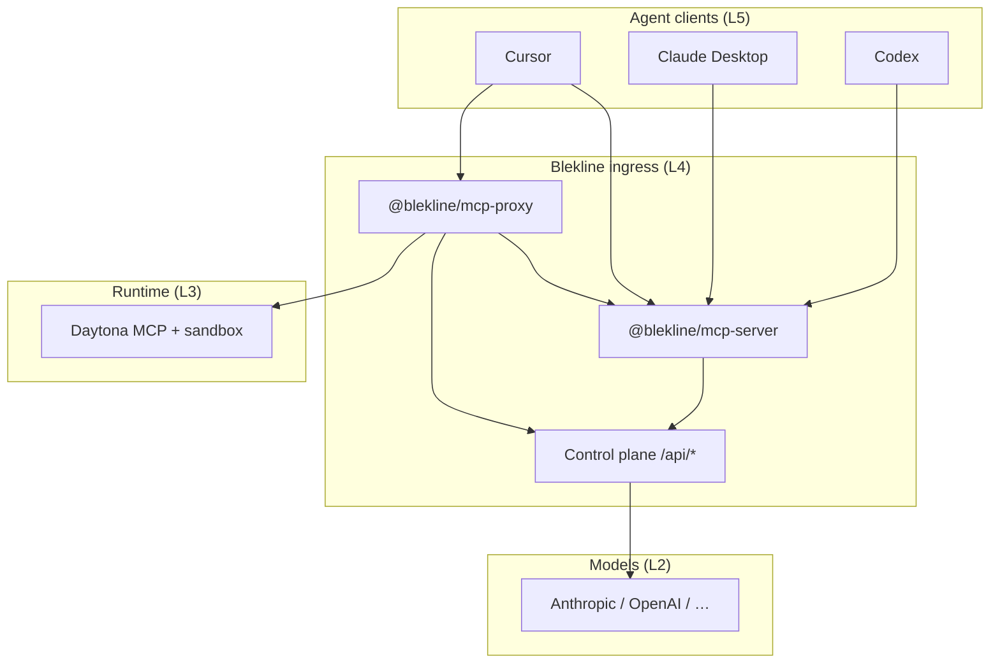

# Architecture

## System view



## ASCII (copy-paste friendly)

```text
[ Cursor | Claude Desktop | Codex ]     Layer 5 — agents
           │ MCP stdio / SSE
           ▼
[ @blekline/mcp-server | @blekline/mcp-proxy ]   Layer 4 — ingress
           │ HTTPS  mask · enforce-tool-call · events
           ▼
[ Blekline control plane — app.blekline.com ]
           ├──────────────► [ Model providers ]          Layer 2
           └──────────────► [ Daytona — approved tools ] Layer 3
```

**Blekline = ingress governance.** **Daytona = runtime isolation.** Together they form the enterprise AI stack.

## Trust & diligence

- [Trust boundaries](../security/trust-boundaries) — what leaves the client, what is metadata-only in audit.
- [MCP identity pinning](../security/mcp-identity-pinning) — downstream server attestation.
- [Latency SLO](../reference/latency-slo) — enforce path p99 targets.

Masking in production uses Blekline backend + Azure PII (not local-only). OSS `contracts` supports **offline dev** secret scan and local tool policy without a token.
